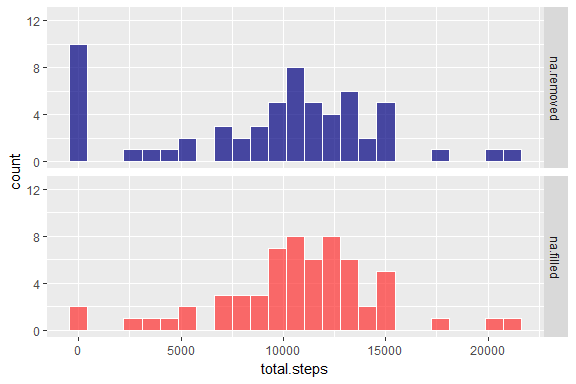
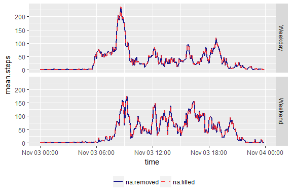

# Reproducible Research: Peer Assessment 1


## Loading and preprocessing the data

Load libraries and data.

```r
library(dplyr)
library(ggplot2)
library(reshape2)
library(knitr)
library(kableExtra)
library(lubridate)
library(scales)


data_url <- 'https://d396qusza40orc.cloudfront.net/repdata%2Fdata%2Factivity.zip'
temp <- tempfile()
download.file(data_url,temp)
activity <- read.csv(unz(temp, "activity.csv"))
```

Define what days are in "weekend" and the order of the weekdays.


```r
## Set weekends and weekday order
weekend <- c('Saturday','Sunday')
weekdays_order <- c('Monday','Tuesday','Wednesday','Thursday','Friday',
                     'Saturday','Sunday')
```

Now preprocess data to give the number of steps at different time intervals:

1. **by5min**: original data, number of steps in each 5 minute interval

2. **byday**: total number of steps each day, summed across all times of day

3. **bytime**: number of steps at each 5 minute interval, averaged across all days


```r
## Make dataframes
by5min <<- activity %>% 
    mutate(hours = interval %/% 100) %>% 
    mutate(minutes = interval%% 100) %>% 
    mutate(datetime = as.POSIXct(paste(date, hours, minutes), 
                                 format='%Y-%m-%d %H %M')) %>% 
    mutate(dayofweek = factor(weekdays(datetime), weekdays_order))  %>%
    mutate(weekday = ifelse(dayofweek  %in% weekend, 'Weekend','Weekday')) %>% 
    mutate(date = date(datetime)) %>% 
    mutate(time = as.POSIXct(format(datetime, '%H %M'),format='%H %M')) %>% 
    select(datetime,date,time,weekday,dayofweek,steps)

byday <<- by5min %>% group_by(date) %>% 
    summarise(total.steps=sum(steps,na.rm=TRUE)) %>% 
    mutate(dayofweek=factor(weekdays(date),weekdays_order))   %>% 
    mutate(weekday = ifelse(dayofweek  %in% weekend, 'Weekend','Weekday')) 

bytime <<- by5min %>% group_by(time) %>% 
    summarise(mean.steps=mean(steps,na.rm = TRUE))
```


## What is mean total number of steps taken per day?


#### - The mean number of steps per day is 9354 

#### - The median number of steps is 10395


The  histogram for number of steps per day is shown below. 


```r
ggplot(byday, aes(x=total.steps)) + 
    geom_histogram(bins=25, color='white', fill='navy', alpha=.7) 
```

<!-- -->

Steps per day is distributed around about 10,000 steps per day. There are a couple of days with near 20,000 steps or more. We also see 10 days with near 0 steps. Some of these are because there were missing values in the data for steps in 5 minute intervals, and when missing values were ignored in summations it led to several days with zero steps. These days are pulling the observed mean and median down away from the true distribution of steps per day.


## What is the average daily activity patatern?

The average daily activity pattern is plotted here:


```r
ggplot(bytime, aes(x=time, y=mean.steps)) + 
    geom_area(group=1, size=1, fill='navy', alpha=0.7) 
```

<!-- -->

#### We see a sharp peak in daily activity in the morning, with the maximum average steps (206 in 5 minutes) at 08:35 AM.

We can also see if the daily pattern differs by the day of the week:


```r
by5min %>% group_by(time,dayofweek) %>% 
    summarise(mean.steps=mean(steps,na.rm = TRUE))  %>% 
    ggplot(aes(x=time, y=mean.steps)) + 
    geom_area(fill='navy', size=.7, alpha=.7, group=1) +
    facet_grid(dayofweek~.)
```

<!-- -->

The activity pattern does differ by day of the week. We see more active early mornings on Monday, Tuesday, and Wednesday. In contrast, Friday Saturday, and Sunday more activity distributed throughtout the middle of the day. 

## Imputing missing values


### Examine patterns in missing values 

The data consisits of 17568 records. Of those,
2304, or 
13% are missing. I examined whether there was any systematic pattern to the missing values and found that there were exactly 8 missing values at every time of day. I also found that there were more missing values on Mondays and Fridays than on other days of the week, and that there were no missing values on Tuesdays.

### Describe technique for replacing missing values

Because the activity pattern depends on both the time of day and day of the week, I used both of those factors for imputing missing values. Missing values are replaced with the avearge from the time of day on the day of week.

### Examine effects of replacing missing values

It is also important to examine how the technique for imputing missing values changes the characteristics of the distribution. 

To that end, I add a new factor to the dataset to code whether missing values were removed (as in the previous analyses) or replaced.

Replace missing values with average from the day of the week and the time of day


```r
by5min <- by5min %>% group_by(dayofweek,time) %>% 
    mutate(na.filled = ifelse( is.na(steps), mean(steps, na.rm=TRUE), steps)) %>% 
    rename(na.removed = steps) %>% 
    melt(id.vars = c('datetime','date','time','weekday','dayofweek'), 
         measure.vars = c('na.removed','na.filled')) %>% 
    rename(na_method = variable, steps = value)
```

Recompute the summary datasets to include the imputed data:


```r
byday <<- by5min %>% group_by(date, na_method) %>% 
    summarise(total.steps=sum(steps,na.rm=TRUE)) %>% 
    mutate(dayofweek=factor(weekdays(date),weekdays_order))   %>% 
    mutate(weekday = ifelse(dayofweek  %in% weekend, 'Weekend','Weekday'))  
bytime <<- by5min %>% group_by(time, na_method) %>% 
    summarise(mean.steps=mean(steps,na.rm=TRUE))
```

The histograms below show the distribution of steps per day before and after imputing the missing values. 


```r
ggplot(byday, aes(x=total.steps, fill=na_method)) + 
    geom_histogram(bins=25, color='white', alpha=0.7) +
    facet_grid(na_method ~ .) +
    scale_fill_manual(values=c('navy','firebrick1')) +
    theme(legend.position = 'top') +
    guides(fill=FALSE) +
    scale_y_continuous(limits=c(0,12.5))
```

<!-- -->


We see the number of days with step counts near 0 have decreased from 10 to 2. In addition, imputing the missing values has slightly increased the number of days with near average step-counts.


## Are there differences in activity patterns between weekdays and weekends?

Below I plot the average daily activity pattern on weekdays and weekends.


```r
by5min %>% group_by(weekday,time,na_method) %>% 
    summarise(mean.steps = mean(steps, na.rm = TRUE))  %>% 
    ggplot(aes(x=time, y=mean.steps, color=na_method, linetype=na_method)) + 
    geom_line(size = 1, alpha=0.9) +
    facet_grid(weekday ~ .) +
    scale_color_manual(name="", values=c('navy','firebrick1')) +
    scale_linetype_manual(name="", values=c('solid','dashed')) +
    theme(legend.position = 'bottom')
```

<!-- -->


Again we see that the daily activity pattern differs depending on the day of the week. The weekdays show activity earlier in the morning comared to the weekdays. In contrast, weekends show more activity in the afternoons. 

In addition, these plots show that imputing the means did not affect the pattern of daily activity very much. One has to look very closely to see any departure between the two lines showing the daily patterns with and without missing values imputed. 


